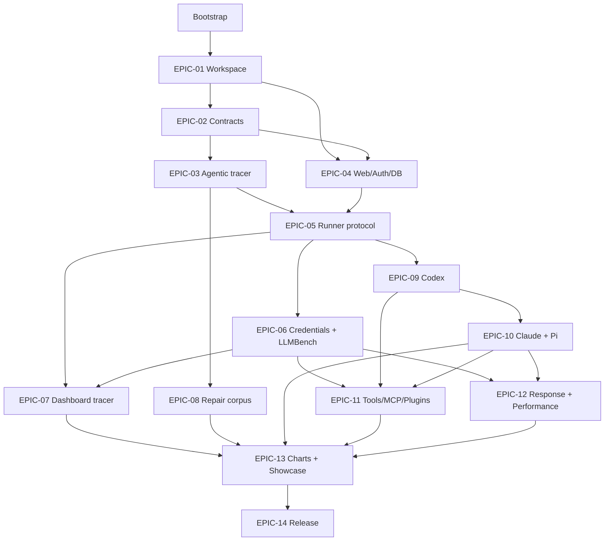

# LLMBench delivery plan

The product contract is in [`PRODUCT_PLAN.md`](PRODUCT_PLAN.md). Each epic below maps to one independently mergeable pull request. Detailed scope and evidence live in the linked brief; the brief is authoritative if the board and brief temporarily disagree.

## Status board

| Done | Epic                                                   | Outcome                                           | Depends on                                  | Status        |
| ---- | ------------------------------------------------------ | ------------------------------------------------- | ------------------------------------------- | ------------- |
| [x]  | [EPIC-01](epics/EPIC-01-workspace-quality.md)          | Workspace and quality foundation                  | Bootstrap                                   | `complete`    |
| [x]  | [EPIC-02](epics/EPIC-02-contracts.md)                  | Benchmark and harness contracts                   | EPIC-01                                     | `complete`    |
| [x]  | [EPIC-03](epics/EPIC-03-agentic-tracer.md)             | Local agentic tracer                              | EPIC-02                                     | `complete`    |
| [x]  | [EPIC-04](epics/EPIC-04-web-auth-persistence.md)       | Web, authentication, and persistence              | EPIC-01, EPIC-02                            | `complete`    |
| [x]  | [EPIC-05](epics/EPIC-05-runner-protocol.md)            | Paired runner and durable jobs                    | EPIC-03, EPIC-04                            | `complete`    |
| [x]  | [EPIC-06](epics/EPIC-06-sealed-credentials-harness.md) | Sealed credentials and LLMBench harness           | EPIC-05                                     | `complete`    |
| [ ]  | [EPIC-07](epics/EPIC-07-dashboard-tracer.md)           | Dashboard experiment tracer                       | EPIC-05, EPIC-06                            | `not_started` |
| [ ]  | [EPIC-08](epics/EPIC-08-repair-corpus.md)              | TypeScript and Python repair corpus               | EPIC-03                                     | `not_started` |
| [ ]  | [EPIC-09](epics/EPIC-09-codex-harness.md)              | Process harness base and Codex                    | EPIC-05                                     | `not_started` |
| [ ]  | [EPIC-10](epics/EPIC-10-claude-pi-harnesses.md)        | Claude Code and Pi harnesses                      | EPIC-09                                     | `not_started` |
| [ ]  | [EPIC-11](epics/EPIC-11-tools-mcp-plugins.md)          | Toolsets, MCP, and plugin SDK                     | EPIC-06, EPIC-09, EPIC-10                   | `not_started` |
| [ ]  | [EPIC-12](epics/EPIC-12-response-performance.md)       | Response and performance benchmarks               | EPIC-06, EPIC-10                            | `not_started` |
| [ ]  | [EPIC-13](epics/EPIC-13-charts-showcase.md)            | Charts and public showcase                        | EPIC-07, EPIC-08, EPIC-10, EPIC-11, EPIC-12 | `not_started` |
| [ ]  | [EPIC-14](epics/EPIC-14-release.md)                    | Hardening, deployment, documentation, and release | EPIC-01–13                                  | `not_started` |

## Dependency graph

EPIC-08 may run in parallel with EPIC-04–07 after EPIC-03 merges. Other work begins only when every declared dependency is `complete` on `main`.

## Repository-wide definition of done

Every applicable epic records successful execution of:

- `pnpm format`
- `pnpm lint`
- `pnpm lint:ws`
- `pnpm typecheck`
- `pnpm boundaries`
- `pnpm test`
- `pnpm test:coverage`
- `pnpm build`
- Relevant Postgres integration and Playwright suites
- macOS/Linux contract tests for runner-affecting changes

Live paid-provider tests remain opt-in and never determine ordinary PR coverage. A merged epic must leave `main` green, document public behavior, include migrations when necessary, and avoid unfinished UI or dead speculative code.

## Global PR rules

- Branch: `codex/epic-XX-short-name`
- PR title: `[EPIC-XX] <outcome>`
- One epic per PR
- One behavior-level RED→GREEN cycle at a time
- No implementation assigned to a later epic
- Epic metadata, board row, checklists, evidence, and handoff updated before review
